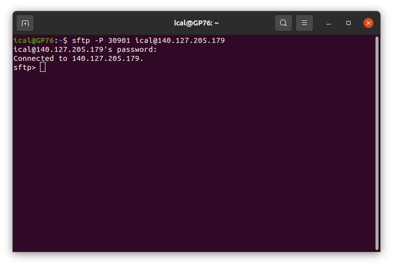
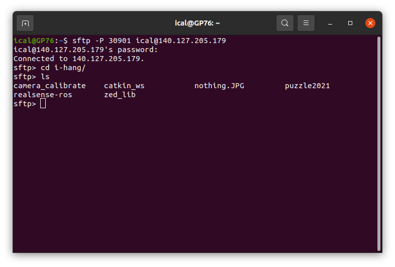
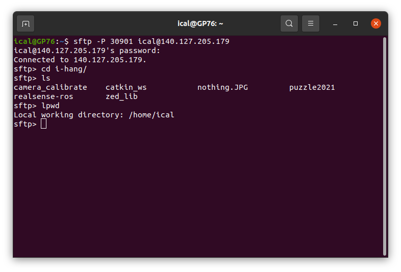
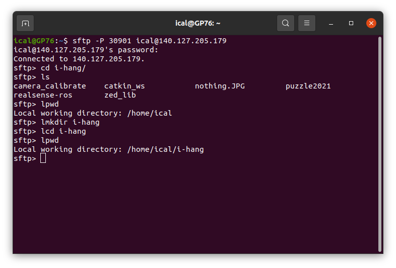
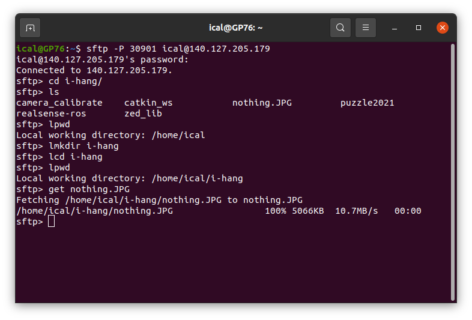

# SFTP_Tutorial

## 簡介

SFTP的中文稱為「安全檔案傳輸協定」。

由FTP（檔案傳輸協定） + SSH兩種技術組合而成，可以實現安全的檔案傳輸。

#＃ 主要用途

* 遠端檔案傳輸

##  使用方法

### 1.登入遠端電腦

```bash
sftp (-P [port]) [使用者名稱]@[ip]
```
* sftp -> sftp程式的執行指令
* 使用者名稱 -> 想要連進去的電腦的使用者名稱
* @ -> 必加，當作用來分割的符號
* ip -> 想要連進去的電腦IP
* -P port -> 如果有多台電腦使用同一個IP，則需要指定通道(port)，注意P是大寫

其實指令跟ssh差不多

### 2. 基本指令

常用指令：
```bash
exit — 結束 SFTP.

#遠方端操作的指令

cd - 變換遠方端伺服器的目錄.

ls - 列出遠方端伺服器目前所在的目錄的所有檔案.

pwd - 列出遠方端伺服器目前所在的目錄名稱.

mkdir - 新增一個遠方端伺服器的目錄.

rmdir - 刪除遠方端伺服器的目錄.

rm - 刪除遠方端伺服器檔案.

rmdir - 刪除遠方端伺服器的目錄.

#本地端的操作指令 (大多是前面家一個l)

lcd - 變換本地端機器的目錄.

lls - 列出本地端目前所在的目錄的所有檔案.

lpwd - 列出本地端機器目前所在的目錄名稱.

lmkdir - 新增一個本地端的目錄.
```
### 3. 下載檔案

```bash
#指定遠端與本地路徑下載檔案
get [遠端路徑] [本地路徑] [要下載的檔案名稱]

#按照目前所選路徑（pwd與lpwd）下載檔案
get [要下載的檔案名稱]

#下載檔案到指定本地資料夾
get [本地路徑] [要下載的檔案名稱]
```

### 4. 上傳檔案

```bash
#指定遠端與本地路徑上傳檔案
put [遠端路徑] [本地路徑] [要上傳的檔案名稱]

#按照目前所選路徑（pwd與lpwd）上傳檔案
put [要上傳的檔案名稱]

#上傳檔案到指定遠端資料夾
put [遠端路徑] [要上傳的檔案名稱]
```

## 5. 範例
使用sftp下載三樓實驗室門口電腦裡小葉老師的祕密檔案

```bash
sftp -P 30901 ical@140.127.205.179
```
然後輸入密碼ical406


進入小葉老師的資料夾
```bash
cd i-hang
#用ls確認所在位置的檔案
ls
```


## ！！！ 那個JPG檔好像有點可疑！！！


利用剛才學到的指令將檔案下載下來
```bash
# 確認本地端指定的目錄
lpwd
```

如果不想放在家目錄，可以自己選擇要放的資料夾
```bash
# 創建新的資料夾i-hang
lmkdir i-hang
# 切換本地端目錄至i-hang
lcd i-hang/
# 再次確認
lpwd
```

```bash
# 確認好後就下載吧
get nothing.JPG
```


看到100％就代表下載成功

輸入exit離開sftp

```bash
exit
```

去看看剛剛下載的祕密照片到底是什麼吧